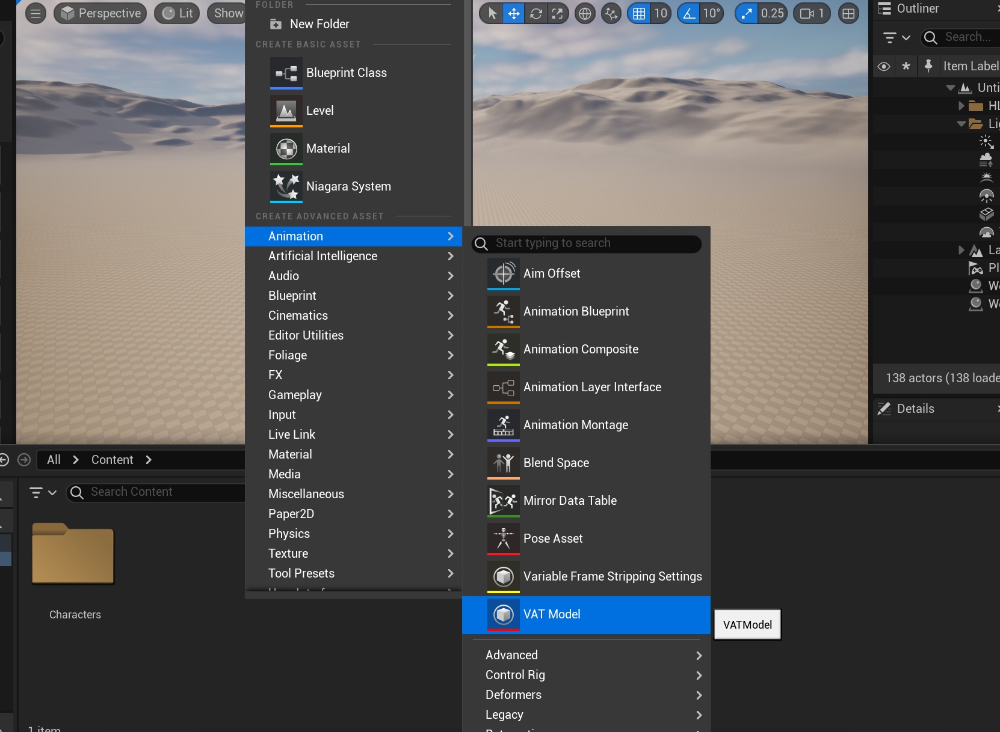
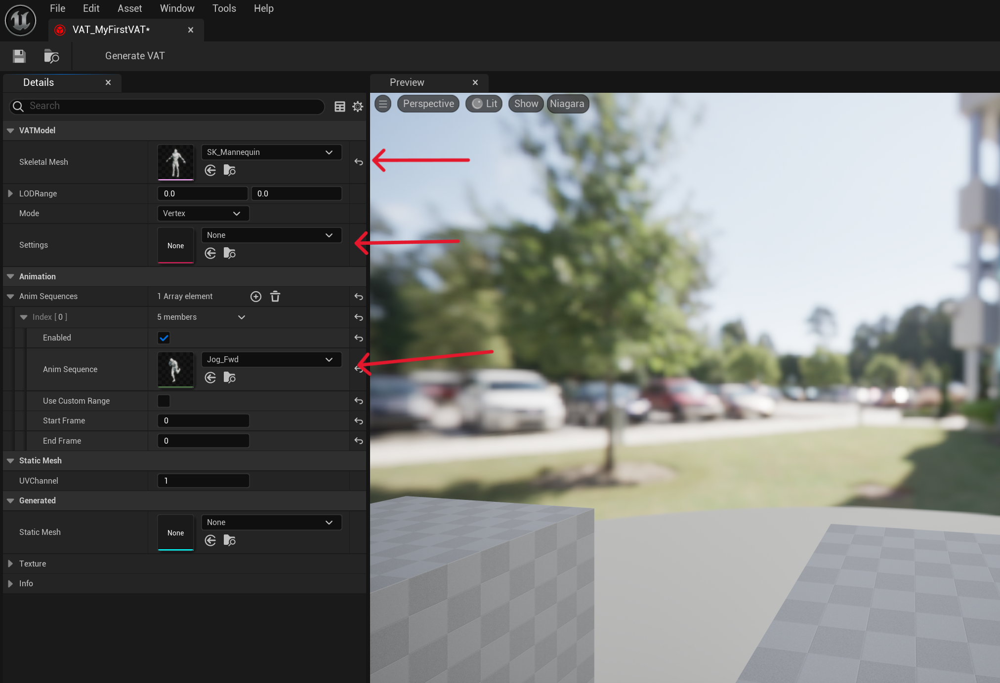
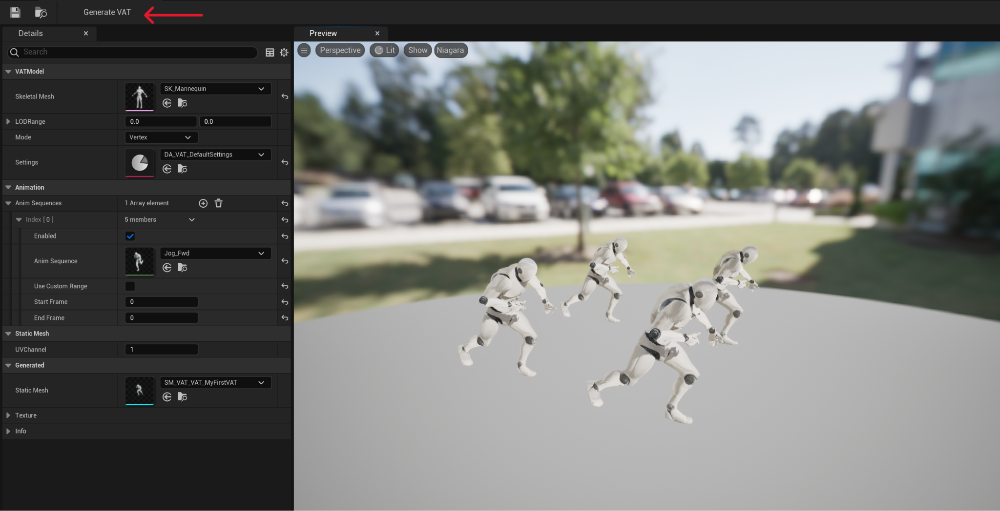

# FastVAT
This Unreal Engine 5 plugin is an extension to the AnimToTexture plugin by Epic Games. (located in /Engine/Plugins/Experimental/AnimToTexture). The plugin further streamlines the process of creating vertex animation textures (VATs) to just a few clicks. 

## Motivation
The original plugin requires the user to jump through hoops by first using an Editor Utility Widget for generating the textures, then manually modifying materials to see the effect happen on a static mesh (which also needs to be generated yourself). Some of these steps are trivial, some are more cumbersome - especially with more complicated materials (e.g. Metahumans). This plugin aims to streamline the whole process with the goal of having the user just complete a few steps to get the final effect: 
1. Create a UVATModel asset
2. Select the desired skeletal mesh + animations in the asset editor
3. Click the generate button

## Features
In this plugin you'll find:
- An asset editor for the UVATModel .uasset to configure and preview the generated VATs
- A VATSettings UDataAsset to share common configurations among multiple VATModels
- Automatically generated UMaterials/Instances, with all logic and references handled

## Getting Started
You can perform the following example within this project:
1. Create a UVATModel asset

2. Open it, and select your desired USkeletalMesh, animations, and UVATSettings UDataAsset

3. Click Generate VAT

## Looking Ahead
Further work I want to accomplish with this plugin:
- Nanite support
- MetaHuman support
- Refactor the original driving materials for the VAT effect

